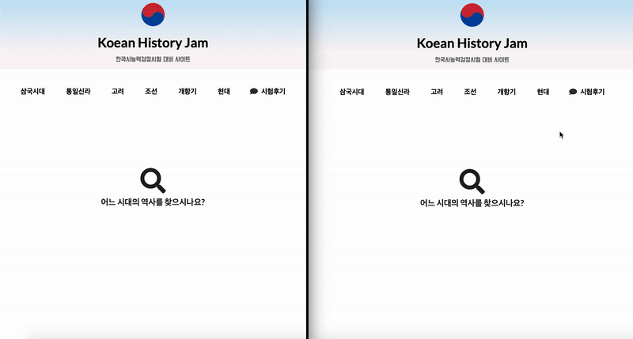
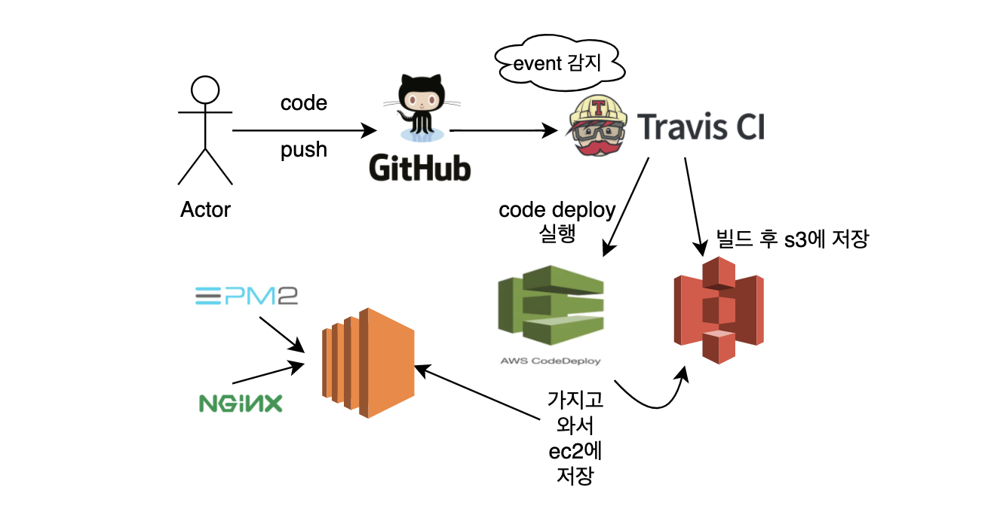

# </> korean History Jam 개발 요약

## 웹사이트

[www.koreanhistoryjam.com](http://www.koreanhistoryjam.com)

## 기술

- React
- node.js / socket.io
- mongoDB
- REST API
- AWS ec2 Linux / Route 53 / codedeploy / s3 / travis ci

## 기능

- socket 실시간 채팅
- 한국사 시대별 토픽카드
- react의 라우팅을 활용한 SPA
- 배포자동화

## 사진

